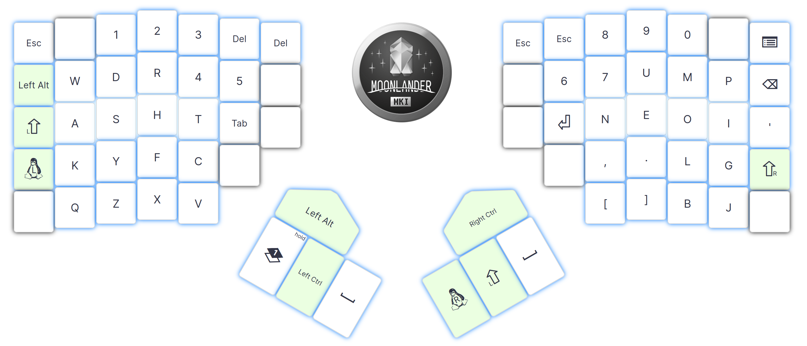

This is a fork of ZSA's official repository: '[`zsa/qmk_firmware`](https://github.com/zsa/qmk_firmware/)'

# WDR45
WDR45 is a custom keyboard layout, loosely inspired by the [Workman](https://workmanlayout.org/) layout, but adapted to fit my personal preferences.
It is particularly intended for split ortholinear/columnar keyboards. Specifically these keyboards:
- [Kinesis Advantage360 Pro](https://kinesis-ergo.com/shop/adv360pro/) - WDR45 Repo: [d00astro/Adv360-Pro-ZMK](https://github.com/d00astro/Adv360-Pro-ZMK)
- [Kinesis Advantage2](https://kinesis-ergo.com/keyboards/advantage2-keyboard/) - WDR45 Repo: TBD 
- [ZSA Moonlander](https://www.zsa.io/moonlander/) - You can find WDR45 for the Moonlander on [ZSA Oryx](https://configure.zsa.io/moonlander/layouts/z9Bbj/latest/0) or you can use this Repo to build it using QMK.

## Layout




# Tooling installation
Two tools are needed to customize the keyboard layout:
 - QMK compiler - To compile the keyboard layout binary
 - Wally - To flash the binary to the keypboart

## QMK compiler 
```bash
virtualenv -p python3 .venv
source .venv/bin/activate
pip install qmk
qmk setup zsa/qmk_firmware -b firmware21
```

## Wally 
[Official site](https://www.zsa.io/wally/)

### Debian / Ubuntu
```console
sudo apt install libusb-1.0-0-dev
sudo cp 50-zsa.rules /etc/udev/rules.d/
sudo groupadd plugdev
sudo usermod -aG plugdev $USER
mkdir -p bin
wget -O bin/wally "https://configure.ergodox-ez.com/wally/linux"
chmod +x bin/wally
```

Note that the udev rules in `50-zsa.rules` is only for the Moonlander keyboard. Refer to the official documentation for rules for other keyboards.

# Customize the  Keymap
Optionally edit the Keymap file [`wdr45/keymap.c`]("keyboards/moonlander/keymaps/wdr45/keymap.c") to your hearts content.


# Compile the keyboard layout
```bash
qmk compile -kb moonlander -km wdr45
```

For good measure, create a backup of the keymap:
```bash
mv moonlander_wdr45.bin moonlander_wdr45_$(date +%Y%m%d).bin
```

# Flash the keymap to the Moonlander keyboard
Ensure that the keyboard is connected.

Run the flasher tool, Wally :
```bash
.\bin/wally
```
Follow the onscreen instructions:
1. Select the compiled `bin` file.
2. Press the 'reset' button on the keyboard, using a paperclip or other pokey thing.

# Reference Documentation

* [See the official documentation on docs.qmk.fm](https://docs.qmk.fm)